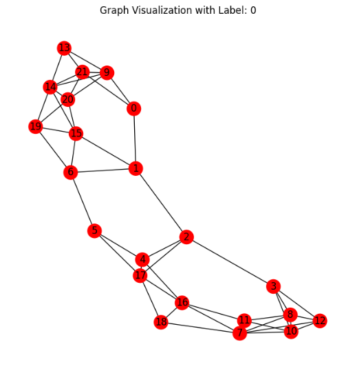
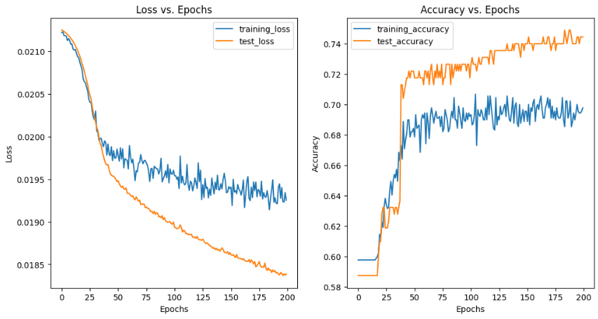

# Enzyme Classifier GNN

This repository contains a Graph Neural Network (GNN) model for classifying enzymes and non-enzymes using the TUDataset "protein". The model is implemented in PyTorch Geometric and includes training and testing scripts.

## Dataset

PROTEINS is a dataset of proteins that are classified as enzymes or non-enzymes. This dataset is collected from the TU Dortmund University. The dataset is included at `data/TUDataset/PROTEINS`.

Here is the sample graph representation of a protein:

## Model

Implemented a GNN which is a Graph Convolutional Network (GCN) followed by a post-message passing layer. Dropout layers and L2 regularization are used to prevent overfitting.

Here are the loss curves and accuracy curves for the final model (`final_protein_gcn_model.pt`):

The `protein_gnn.ipynb` notebook contains the dataset loading, the model's implementation, and the training and evaluation of the model.

